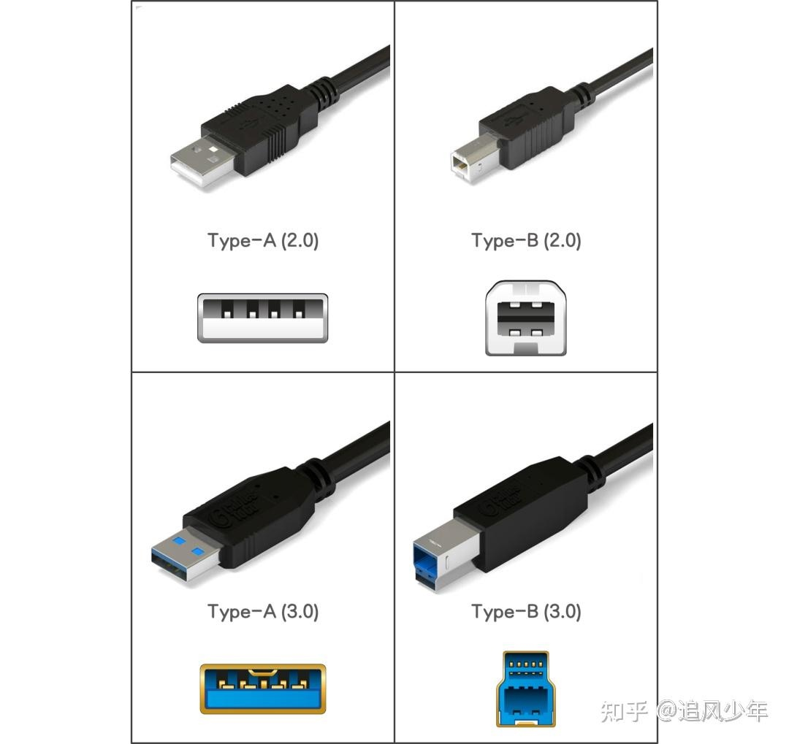

# 关于 Lightning, USB, USB Type-C 和 Thunderbolt 接口

iPhone 5 到 iPhone 14 的充电接口是 Lightning 接口。

USB 接口分为 Type-A, Type-B 和 Type-C 类型。Type-A 和 Type-C 如下所示：

iPhone 15 之后的充电接口是 USB Type-C 接口，也叫做 USB-C 接口。

Macbook 旁边的充电接口是 Thunderbolt 接口。

Thunderbolt（雷电）和 USB-C 是容易混淆的两个概念，前者是高速传输技术标准，后者是物理接口形态。

所有 Thunderbolt 3/4/5 设备均采用 USB-C 接口，但反之不成立：带 USB-C 接口的设备（如手机、普通笔记本）不一定支持 Thunderbolt 技术。例如：MacBook Pro 的 USB-C 接口同时支持 Thunderbolt 4 和 USB 4，而安卓手机的 USB-C 接口通常仅支持 USB 3.2 或更低标准。
