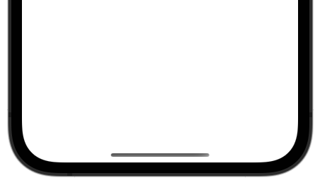
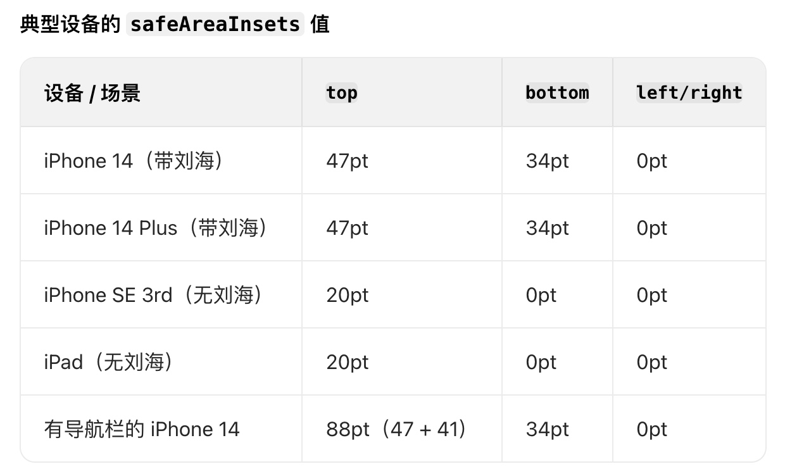

# 基础概念
- Home Indicator: 全面屏底部那个小横条



---

# safeAreaInsets

safeAreaInsets 是 iOS 系统里用于描述安全区域边界的属性，它定义了视图内容中不被系统界面元素（如状态栏、导航栏、标签栏、Home Indicator 等）遮挡的部分。这个概念在全面屏设备（如 iPhone X 及后续机型）上尤为重要，因为这些设备的屏幕边缘存在圆角、刘海或底部操作区域，需要确保内容不会被这些区域遮挡。

1、核心概念
- 安全区域：屏幕上不会被系统元素遮挡的矩形区域。
safeAreaInsets：描述安全区域与视图边界之间的距离（insets），是一个 UIEdgeInsets 结构体，包含四个方向的值：
    - top：安全区域顶部与视图顶部的距离。
    - left：安全区域左侧与视图左侧的距离。
    - bottom：安全区域底部与视图底部的距离。
    - right：安全区域右侧与视图右侧的距离。



2、获取 safeAreaInsets
```
let insets = view.safeAreaInsets
print("安全区域 insets: \(insets)")
```

在 **viewDidLayoutSubviews** 或 **safeAreaInsetsDidChange** 里获取最新值：
```
override func safeAreaInsetsDidChange() {
    super.safeAreaInsetsDidChange()
    let insets = view.safeAreaInsets
    // 更新布局
}
```

3、与 **contentInset** 的关系
当 UIScrollView 的 contentInsetAdjustmentBehavior 不为 .never 时，系统会自动将 safeAreaInsets 合并到 contentInset 里，确保滚动内容不被遮挡。

示例：如果刘海屏顶部 inset 为 47pt，导航栏高度为 41pt，那么：
```
scrollView.contentInsetAdjustmentBehavior = .automatic
// 最终 contentInset.top = 47pt + 41pt = 88pt
```

4、和 autoLayout 结合

推荐使用 **safeAreaLayoutGuide** 进行布局，而不是直接使用 safeAreaInsets:
```
// 正确方式：使用 safeAreaLayoutGuide
label.leadingAnchor.constraint(equalTo: view.safeAreaLayoutGuide.leadingAnchor).isActive = true

// 不推荐：直接使用 safeAreaInsets（需手动更新）
label.frame.origin.x = view.safeAreaInsets.left
```
